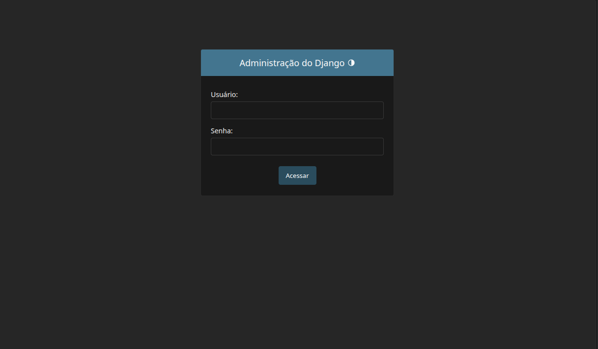
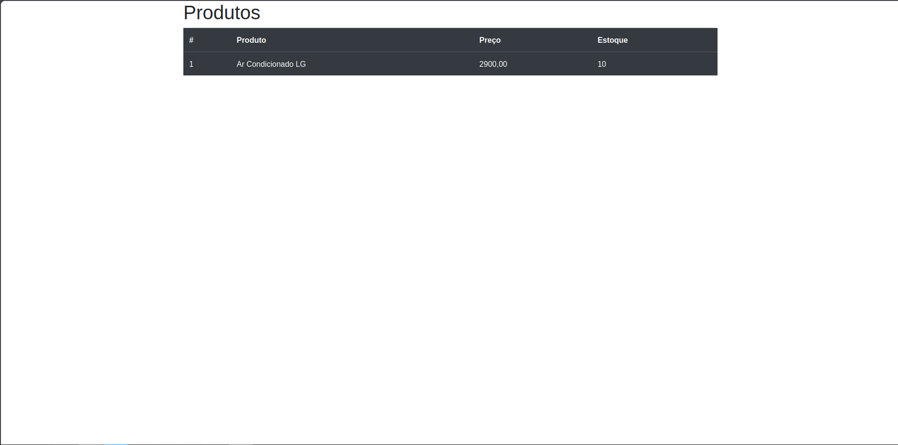

# 🛒 MyHomeAdvanced - Sistema de Gerenciamento e Estoque

Um sistema web desenvolvido em **Django** para o cadastro de grupos, usuários e gerenciamento de estoque de produtos. O projeto foi idealizado inicialmente para ser a base de uma loja virtual e passou recentemente por uma modernização de código assistida por Inteligência Artificial (Google Antigravity).

## 🚀 Status do Projeto
🚧 **Em Desenvolvimento** - A base do controle de estoque e usuários está funcional. A etapa de conversão final para loja virtual com carrinho de compras é o foco das futuras atualizações.

## 📸 Imagens do Sistema

> **Nota:** Adicione os prints nas respectivas pastas e atualize os nomes dos arquivos abaixo, se necessário.

### Tela de Autenticação / Login


### Cadastro de Produto no Estoque


## ✨ Principais Funcionalidades

De acordo com as rotas e controles atuais (`core/views.py`), o sistema já conta com:

* **Controle de Acesso e Autenticação:** Sistema seguro onde apenas usuários logados e autenticados têm permissão para cadastrar novos itens no estoque. Visitantes anônimos são redirecionados.
* **Cadastro Completo de Produtos (`/product/`):** Inserção de novos produtos no banco de dados SQLite contendo imagem, preço, quantidade e descrição. 
* **Catálogo de Estoque (`/`):** Página inicial que consulta o banco de dados e exibe a vitrine com todos os produtos já registrados.
* **Formulário de Contato (`/contact/`):** Canal de comunicação para visitantes com sistema de validação de dados e envio de mensagens com feedback em tela.

## 🛠️ Tecnologias Utilizadas

* **Linguagem:** Python
* **Framework Web:** Django (3.1)
* **Banco de Dados:** SQLite (com suporte facilitado para migração para PostgreSQL/MySQL)
* **Front-end:** HTML5, CSS3, e Bootstrap 4
* **Bibliotecas Extras:** `django-stdimage` (para processamento de imagens) e `dj-database-url`.

## ⚙️ Como rodar o projeto localmente

Siga os passos abaixo para testar o projeto na sua máquina:

1. **Abra o terminal e acesse a pasta do projeto.**
2. **Crie e ative um ambiente virtual:**
   ```bash
   python -m venv venv
   source venv/bin/activate  # No Linux/Mac
   pip install -r requirements.txt
   python manage.py migrate
   python manage.py createsuperuser
   python manage.py runserver
   Acesse no navegador: http://127.0.0.1:8000/

🔮 Próximos Passos (To-Do)

[ ] Concluir o fluxo de loja virtual (carrinho e checkout).

[ ] Refinar o layout visual com CSS customizado.

[ ] Implementar sistema de recuperação de senhas.
   
   
